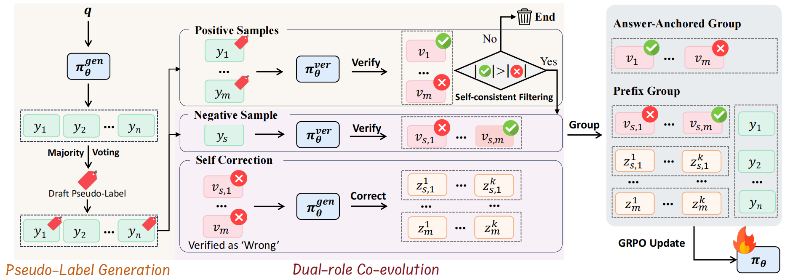
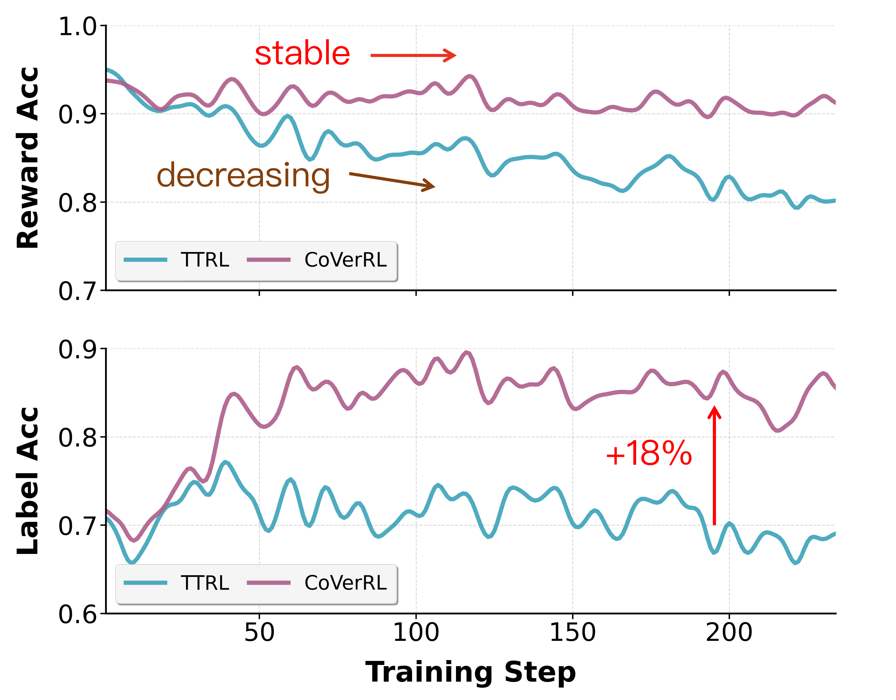
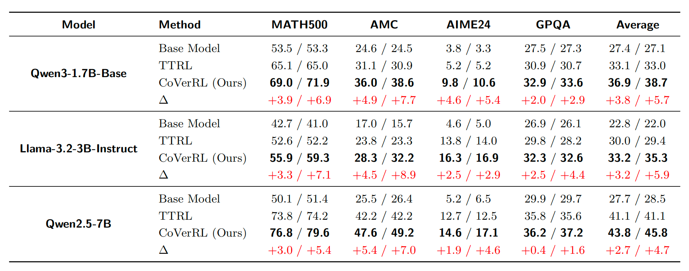

<div align="center">
     <h1>CoVerRL: Breaking the Consensus Trap in Label-Free Reasoning via
Generator-Verifier Co-Evolution</h1>
</div>

<div align='center'> 

[Teng Pan](mailto:pt6@zju.edu.cn)<sup>1,2,\*</sup>, &nbsp;
Yuchen Yan<sup>1</sup>, &nbsp;
Zixuan Wang<sup>1,2</sup>, &nbsp;
Ruiqing Zhang<sup>2</sup>, &nbsp;
<br>
Guiyang Hou<sup>1</sup>, &nbsp;
Wenqi Zhang<sup>1</sup>, &nbsp;
Weiming Lu<sup>1</sup>, &nbsp;
Jun Xiao<sup>1</sup>, &nbsp;
[Yongliang Shen](mailto:syl@zju.edu.cn)<sup>1,†</sup>  

<sup>1</sup>Zhejiang University, &nbsp;
<sup>2</sup>Baidu Inc.\
<em>Preprint.</em>  
<sup>*</sup>Contribution during internship at Baidu Inc. <sup>†</sup>Corresponding Author
</div>


<!-- <p align="center">
 <a href="https://arxiv.org/abs/2602.06960">Arxiv</a> 
| 📑 <a href="https://zju-real.github.io/InftyThink-Plus/">WebPage</a> 
<br>
</p> -->

<!-- ## News 🔥🔥
- **2026.03.16:** We release our paper. -->

## 📖 Overview 
Label-free reinforcement learning for LLMs typically adopts majority voting to generate pseudo-labels, but suffers from a consensus trap—output diversity collapses during training, leading the model to confidently reinforce systematic self-consistent errors. To address this issue, we propose CoVerRL, a novel framework that unifies generator and verifier roles into a single model via multi-turn reinforcement learning, enabling their mutual bootstrapping and co-evolution without external ground-truth labels.



Our contributions can be summarized as follows:

- We identify the consensus trap in majority voting based label-free RL, where diversity collapse causes
reward accuracy degradation as models become overconfident in systematic errors, explaining why such
methods eventually stagnate.

- We propose CoVerRL, a co-evolution framework that unifies generation and verification into a multi-turn
RL process, enabling mutual bootstrapping where each capability supervises improvement of the other
without external labels.

- We validate CoVerRL across Qwen and Llama model families, demonstrating 4-6% improvements over
label-free baselines on mathematical reasoning benchmarks while producing verifiers that generalize well to
held-out evaluation.


## 🚀 QuickStart 
### Preparation
This repository is based on verl v0.6.x branch. Please refer to 
<a href='https://verl.readthedocs.io/en/latest/start/install.html'>verl installation</a> for setup instructions. Additionally, install <a href='https://github.com/huggingface/Math-Verify'>Math-Verify</a> as the verifier: ``` pip install math-verify ```. It is recommended to install swanlab or wandb to visualize the training dynamics. ``` pip install swanlab ```

Before running the script, set the model path in it.
```
BACKBONE="your backbone"
BACKBONE_PATH="path to your backbone"
```

### TTRL baseline
```bash
cd verl
bash recipe/cover_rl/scripts/gpu/ttrl_baseline.sh
```
### CoVerRL
```bash
cd verl
bash recipe/cover_rl/scripts/gpu/cover_rl.sh
```

If you want to run with NPU, we also provide scripts in the "npu" folder, feel free to use it.

## 📊 Dataset
The training data is stored in ```verl/recipe/cover_rl/data/MATH-7500/math7500_train.parquet```. And the validation data is stored in un. If you want to prepare your own dataset, refer to  ```verl/recipe/cover_rl/data/preprocess.py```


## 📈 Main results
Results are reported as Acc.@first / Acc.@final.
CoVerRL consistently outperforms TTRL across all models and benchmarks, achieving average improvements of 5.7%, 5.9%, and 4.7% in Acc.@final for the three models respectively.

<!-- ### Qwen3-1.7B-Base

| **Method**         | **MATH500**     | **AMC**         | **AIME24**      | **GPQA**        | **Average**     |
|---------------------|-----------------|-----------------|-----------------|-----------------|-----------------|
| Base Model          | 53.5 / 53.3     | 24.6 / 24.5     | 3.8 / 3.3       | 27.5 / 27.3     | 27.4 / 27.1     |
| TTRL                | 65.1 / 65.0     | 31.1 / 30.9     | 5.2 / 5.2       | 30.9 / 30.7     | 33.1 / 33.0     |
| CoVerRL (Ours)      | **69.0 / 71.9** | **36.0 / 38.6** | **9.8 / 10.6**  | **32.9 / 33.6** | **36.9 / 38.7** |
| Δ                   | +3.9 / +6.9     | +4.9 / +7.7     | +4.6 / +5.4     | +2.0 / +2.9     | +3.8 / +5.7     |


#### Llama-3.2-3B-Instruct
| **Method**         | **MATH500**     | **AMC**         | **AIME24**      | **GPQA**        | **Average**     |
|---------------------|-----------------|-----------------|-----------------|-----------------|-----------------|
| Base Model          | 42.7 / 41.0     | 17.0 / 15.7     | 4.6 / 5.0       | 26.9 / 26.1     | 22.8 / 22.0     |
| TTRL                | 52.6 / 52.2     | 23.8 / 23.3     | 13.8 / 14.0     | 29.8 / 28.2     | 30.0 / 29.4     |
| CoVerRL (Ours)      | **55.9 / 59.3** | **28.3 / 32.2** | **16.3 / 16.9** | **32.3 / 32.6** | **33.2 / 35.3** |
| Δ                   | +3.3 / +7.1     | +4.5 / +8.9     | +2.5 / +2.9     | +2.5 / +4.4     | +3.2 / +5.9     |

### Qwen2.5-7B
| **Method**         | **MATH500**     | **AMC**         | **AIME24**      | **GPQA**        | **Average**     |
|---------------------|-----------------|-----------------|-----------------|-----------------|-----------------|
| Base Model          | 50.1 / 51.4     | 25.5 / 26.4     | 5.2 / 6.5       | 29.9 / 29.7     | 27.7 / 28.5     |
| TTRL                | 73.8 / 74.2     | 42.2 / 42.2     | 12.7 / 12.5     | 35.8 / 35.6     | 41.1 / 41.1     |
| CoVerRL (Ours)      | **76.8 / 79.6** | **47.6 / 49.2** | **14.6 / 17.1** | **36.2 / 37.2** | **43.8 / 45.8** |
| Δ                   | +3.0 / +5.4     | +5.4 / +7.0     | +1.9 / +4.6     | +0.4 / +1.6     | +2.7 / +4.7     | -->

| **Model**                  | **Method**         | **MATH500**     | **AMC**         | **AIME24**      | **GPQA**        | **Average**     |
|------------------------|----------------|-------------|-------------|-------------|-------------|-------------|
| **Qwen3-1.7B<br>-Base**    | Base Model     | 53.5 / 53.3 | 24.6 / 24.5 | 3.8 / 3.3   | 27.5 / 27.3 | 27.4 / 27.1 |
|                        | TTRL           | 65.1 / 65.0 | 31.1 / 30.9 | 5.2 / 5.2   | 30.9 / 30.7 | 33.1 / 33.0 |
|                        | CoVerRL (Ours) | **69.0 / 71.9** | **36.0 / 38.6** | **9.8 / 10.6**  | **32.9 / 33.6** | **36.9 / 38.7** |
|                        | Δ              | +3.9 / +6.9  | +4.9 / +7.7  | +4.6 / +5.4  | +2.0 / +2.9  | +3.8 / +5.7  |
| **Llama-3.2-3B<br>-Instruct** | Base Model | 42.7 / 41.0 | 17.0 / 15.7 | 4.6 / 5.0   | 26.9 / 26.1 | 22.8 / 22.0 |
|                        | TTRL           | 52.6 / 52.2 | 23.8 / 23.3 | 13.8 / 14.0 | 29.8 / 28.2 | 30.0 / 29.4 |
|                        | CoVerRL (Ours) | **55.9 / 59.3** | **28.3 / 32.2** | **16.3 / 16.9** | **32.3 / 32.6** | **33.2 / 35.3** |
|                        | Δ              | +3.3 / +7.1  | +4.5 / +8.9  | +2.5 / +2.9  | +2.5 / +4.4  | +3.2 / +5.9  |
| **Qwen2.5-7B**         | Base Model     | 50.1 / 51.4 | 25.5 / 26.4 | 5.2 / 6.5   | 29.9 / 29.7 | 27.7 / 28.5 |
|                        | TTRL           | 73.8 / 74.2 | 42.2 / 42.2 | 12.7 / 12.5 | 35.8 / 35.6 | 41.1 / 41.1 |
|                        | CoVerRL (Ours) | **76.8 / 79.6** | **47.6 / 49.2** | **14.6 / 17.1** | **36.2 / 37.2** | **43.8 / 45.8** |
|                        | Δ              | +3.0 / +5.4  | +5.4 / +7.0  | +1.9 / +4.6  | +0.4 / +1.6  | +2.7 / +4.7  |


The figure below shows the training dynamics of reward/label accuracy for TTRL and CoVerRL on Qwen3-1.7B-Base. CoVerRL maintains reward accuracy above around 90% and boosts label accuracy via generator-verifier co-evolution, while TTRL faces reward accuracy degradation and stagnant label accuracy due to the consensus trap.
<p align="center">
  
</p>

<!-- ## Main Results 
<p align="center">
  
</p> -->


## 📄 Citation

If you find our work helpful, feel free to give us a cite.

<!-- ```
@misc{yan2026inftythinkplus,
      title={CoVerRL: Breaking the Consensus Trap in Label-Free Reasoning via Generator-Verifier Co-Evolution}, 
      author={Yuchen Yan and Liang Jiang and Jin Jiang and Shuaicheng Li and Zujie Wen and Zhiqiang Zhang and Jun Zhou and Jian Shao and Yueting Zhuang and Yongliang Shen},
      year={2026},
      eprint={2602.06960},
      archivePrefix={arXiv},
      primaryClass={cs.CL},
      url={https://arxiv.org/abs/2602.06960}, 
}
``` -->

## 🙏 Acknowledgement

The RL training stack is built on top of the excellent [verl](https://github.com/volcengine/verl) framework. Many thanks to the verl team for open-sourcing the infrastructure that this project extends.
